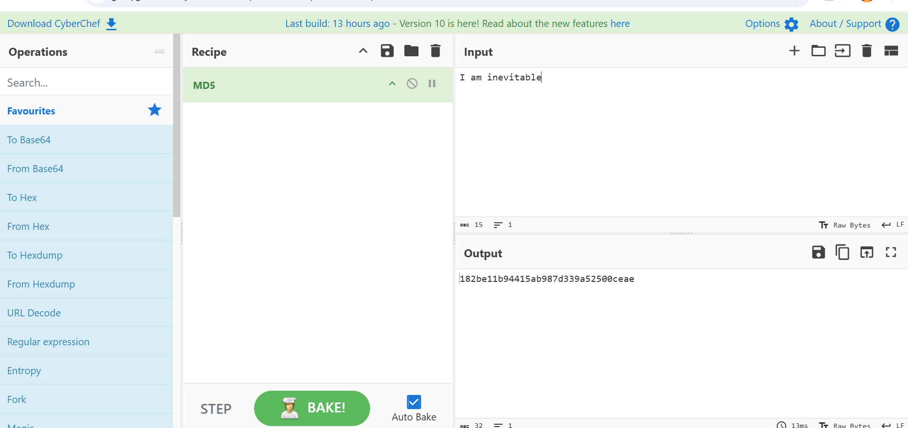
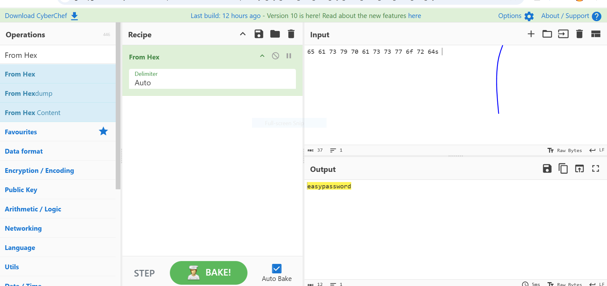
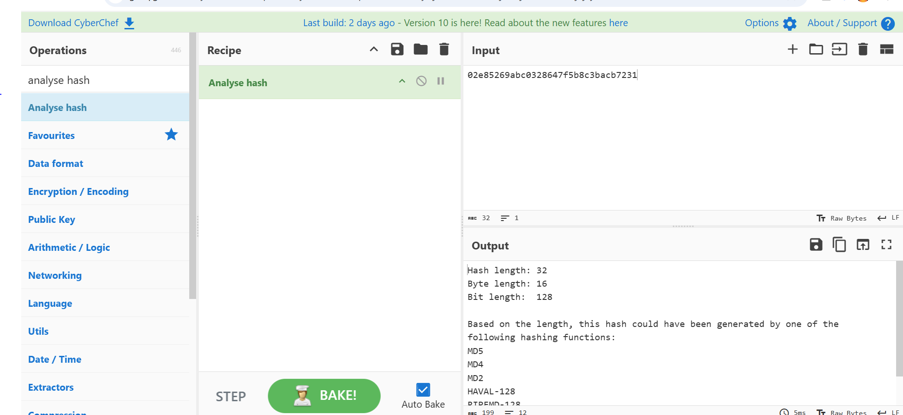
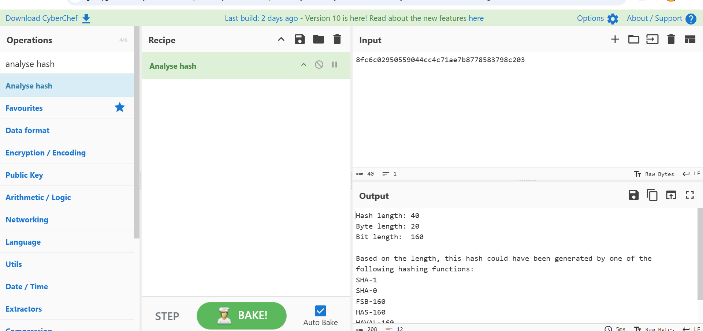
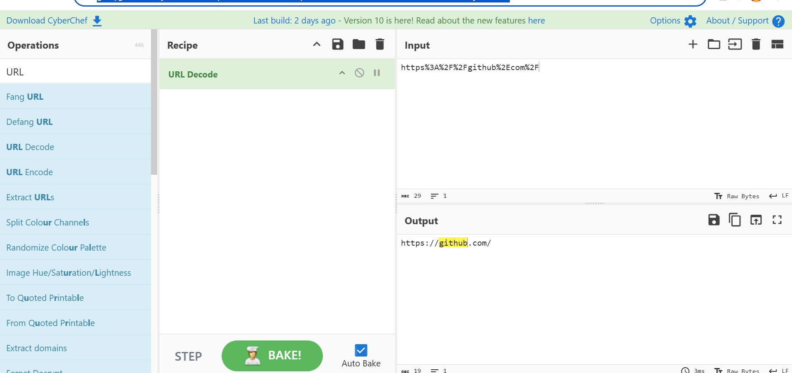
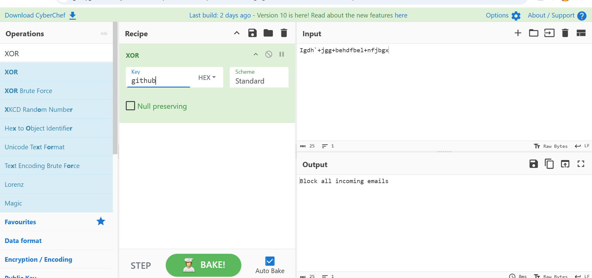
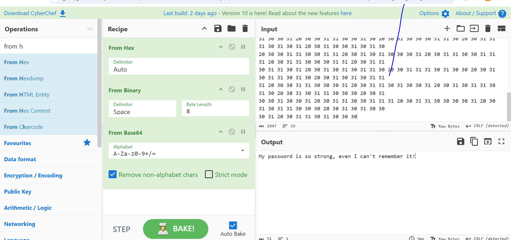
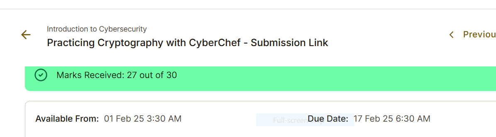

# CyberChef Cryptography Analysis

**Project completed:** 2025  
**Published to GitHub portfolio:** 2026  
**Assessment result:** 27/30

## 🔎 Project Overview

This project demonstrates practical cryptography and data-decoding tasks using CyberChef.

The lab involved validating file integrity with MD5 hashing, decoding hexadecimal data, analyzing unknown hashes, decoding URL-encoded content, working with XOR operations, identifying symmetric encryption concepts, and performing multi-step decoding to recover hidden messages.

---

## 🎯 Project Objectives

- Validate file integrity using MD5 hashes
- Understand the security purpose of cryptographic hashes
- Decode hexadecimal data
- Analyze unknown hash values
- Determine hash lengths and possible hash algorithms
- Decode URL-encoded content
- Identify XOR logical operations
- Use XOR to decrypt encoded communication
- Distinguish symmetric from asymmetric encryption
- Perform multi-step data decoding in CyberChef
- Recover hidden messages from encoded data

---

## 🔐 File Integrity Verification with MD5

CyberChef was used to generate an MD5 hash for a supplied document and compare it with a known hash value.

A matching hash demonstrates that the file has not been altered or tampered with.

In this scenario, the MD5 hash acted as a digital fingerprint that helped verify the integrity of the document.

---

## 🔡 Hexadecimal Decoding

CyberChef's **From Hex** operation was used to decode hexadecimal input and recover readable information.

This demonstrated how encoded data can be transformed back into plaintext during security analysis.

---

## #️⃣ Hash Analysis

The **Analyse Hash** operation in CyberChef was used to examine unknown hash values.

The analysis included:

- Determining hash length
- Determining byte and bit length
- Identifying possible hashing algorithms based on the hash structure
- Comparing characteristics of different hash formats

Both 32-character and 40-character hash values were investigated.

---

## 🌐 URL Decoding

CyberChef's **URL Decode** operation was used to decode:

`https%3A%2F%2Fgithub%2Ecom%2F`

The decoded result was:

`https://github.com/`

This demonstrated how URL-encoded strings can be interpreted during security investigations.

---

## 🔑 XOR Decryption

The project identified the logical operation described by:

> Outputs are true only when the number of true inputs is odd.

The operation was identified as:

**XOR — Exclusive OR**

CyberChef was then used to apply XOR decoding to encrypted communication.

---

## 🔒 Symmetric Encryption Analysis

The encryption method used in the scenario was identified as:

**Symmetric encryption**

This is because the same secret key was used for both encryption and decryption.

In contrast, asymmetric encryption uses separate public and private keys.

---

## 🧩 Multi-Step Message Decoding

The project also required combining multiple CyberChef operations to recover hidden information from encoded data.

The workflow included operations such as:

- Hex decoding
- Binary decoding
- Base64 decoding

This demonstrated how layered encoding techniques can be investigated by applying transformations in the correct sequence.

---

## 🛡️ Skills Demonstrated

- CyberChef
- Cryptography Fundamentals
- MD5 Hashing
- File Integrity Verification
- Hash Analysis
- Hexadecimal Decoding
- URL Decoding
- XOR Operations
- Symmetric Encryption
- Data Encoding and Decoding
- Multi-Step Decoding
- Security Analysis
- Digital Forensics Fundamentals

---

## 📈 Key Takeaways

This project strengthened my understanding of how cryptographic hashes, encodings and logical operations are used in cybersecurity.

It also demonstrated how CyberChef can help security analysts transform, inspect and decode suspicious data during investigations.

The lab reinforced the importance of file-integrity verification, understanding hash formats and selecting the correct decoding operations when analyzing encoded information.

---

## 📸 Project Screenshots

### 1. MD5 File Integrity Validation

### 2. Hexadecimal Password Decoding

### 3. 32-Character Hash Analysis

### 4. 40-Character Hash Analysis

### 5. URL Decoding

### 6. XOR Message Decryption

### 7. Multi-Step Hidden Message Decoding

### 8. Assessment Result — 27/30

---

## 📄 Project Evidence

The completed Practicing Cryptography with CyberChef submission is included in this repository as supporting evidence.

[📄 View CyberChef Cryptography Submission](Practicing%20Cryptography%20with%20CyberChef%20-%20Submission.docx)

The project evidence demonstrates MD5 integrity verification, hexadecimal decoding, hash analysis, URL decoding, XOR operations, symmetric-encryption concepts and multi-step message decoding using CyberChef.

**Assessment result:** 27/30

[🏆 View Assessment Result](screenshots/08-cyberchef-assessment-result-27-of-30.png)

---

## 👨‍💻 Author

**Benard Obi Kekong**

Cybersecurity Analyst | CompTIA Security+ | SOC & GRC | Microsoft Sentinel | SIEM | Risk Assessment | Python
